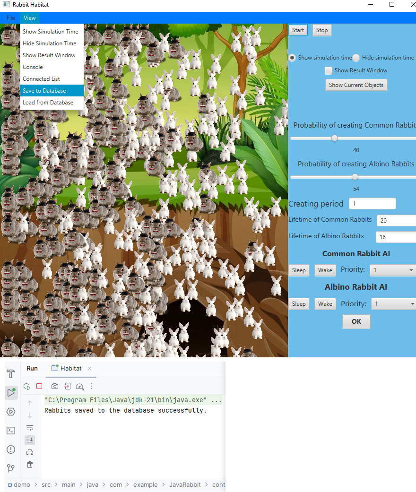

# RabbitsJava
# This An UNI Project was asked to create a habitat of two types of rabbits ( Albino and Common ) 

---

## 📷 GUI Preview

---
# User #are able to : 
# 1- Control the creating period and the amount of borning rabbits per seconds.
# 2- Using database to save and import saved rabbits from table .
# 3- saving configration of simulating into txt file.
# 4- saving serialized objects in file.
# 5- loading serialized objects from file. 
# 6- creating TCP server class to represent a server that clients / users communicating through it to sending simulating configration to all who are connected to the same server. 
# 7- a console window that takes commands from user such as reducing albino with percentage. 
# 8- user are able to set a periority for threads of objects !
